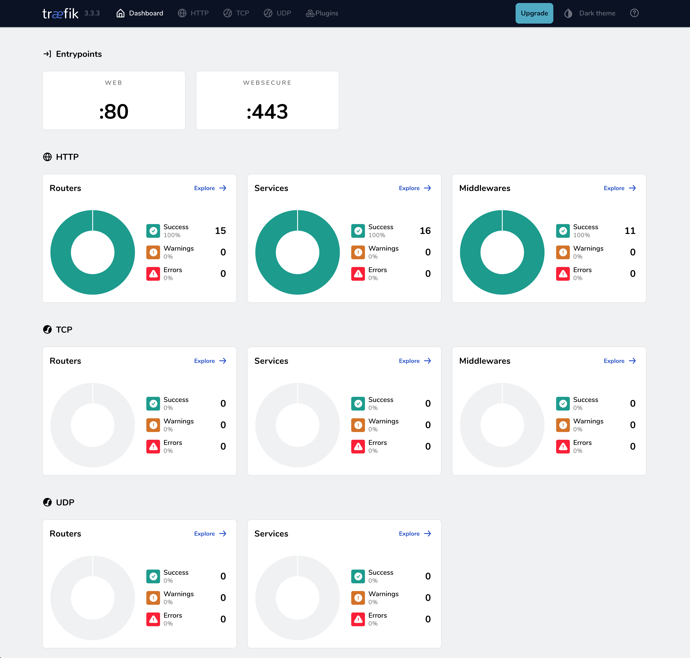

# 🚀 Docker Proxy Yapılandırması

# Neden Traefik?

Traefik, modern web uygulamaları için tasarlanmış güçlü ve dinamik bir ters proxy çözümüdür. Tercih edilmesinin başlıca nedenleri:

- **Otomatik Keşif:** Docker konteynerlerini otomatik olarak algılar ve yapılandırır
- **Dinamik Yapılandırma:** Çalışma zamanında değişiklikleri algılar, yeniden başlatma gerektirmez
- **Modern Protokol Desteği:** HTTP/2, HTTP/3, WebSocket ve gRPC desteği
- **Kolay Entegrasyon:** Docker, Kubernetes ve diğer modern platformlarla sorunsuz çalışır
- **SSL/TLS Otomasyonu:** Let's Encrypt ile otomatik sertifika yönetimi
- **Merkezi Logging:** Tüm proxy trafiği için merkezi günlük kaydı
- **Güvenlik Özellikleri:** Rate limiting, IP filtreleme ve modern güvenlik başlıkları
- **Görselleştirme:** Dahili dashboard ile kolay izleme ve yönetim

## Proje Genel Bakış

Bu Docker projesi, modern bir ters proxy ve yük dengeleyici olarak Traefik'i kullanır ve Cloudflare DNS güvenliği ile Let's Encrypt SSL sertifikalarını entegre eder.

## Temel Faydalar

- **Otomatik SSL Sertifikaları:** Let's Encrypt entegrasyonu ile sorunsuz HTTPS uygulaması
- **Gelişmiş Güvenlik:** DDoS saldırılarına ve kötü niyetli trafiğe karşı Cloudflare DNS koruması
- **Dinamik Yapılandırma:** Docker konteynerleri için otomatik servis keşfi ve yönlendirme
- **Yük Dengeleme:** Gelen trafiğin çoklu servisler arasında verimli dağıtımı
- **Kolay Bakım:** Docker konteynerleri aracılığıyla çoklu servislerin basit konfigürasyonu ve yönetimi

## Güvenlik Özellikleri

Proje birden fazla güvenlik katmanı içerir:

- Cloudflare DNS koruması
- Let's Encrypt ile SSL/TLS şifreleme
- Güvenli başlıklar ve ara yazılım yapılandırması
- Rate Limiting ile DDoS koruması
- IP Whitelist desteği
- Modern güvenlik başlıkları (HSTS, XSS Protection, Content Security Policy)

## Kullanım Alanları

- Web uygulama dağıtımı
- Mikroservis mimarisi
- Geliştirme ve test ortamları
- Üretime hazır altyapı kurulumu

## Kurulum

1. Projeyi klonlayın
2. `.env.example` dosyasını `.env` olarak kopyalayın ve gerekli değişkenleri ayarlayın
3. `make fix` komutu ile gerekli ağ ve dosya izinlerini ayarlayın
4. `make up` komutu ile servisleri başlatın

## Komutlar

- `make up`: Servisleri başlatır
- `make down`: Servisleri durdurur
- `make restart`: Servisleri yeniden başlatır
- `make logs`: Servis loglarını gösterir
- `make ps`: Çalışan konteynerleri listeler
- `make clean`: Kullanılmayan Docker kaynaklarını temizler

## Gereksinimler

- Docker 24.0+
- Docker Compose v2.20+
- Make

# CI/CD

Proje, GitHub Actions ile otomatik deployment sürecine sahiptir. Master branch'e yapılan her push işleminden sonra:

- VPS sunucuya otomatik deployment yapılır
- Docker servisleri yeniden başlatılır
- Eski Docker image'ları temizlenir

Deployment için gerekli secret'lar:

- SSH_PRIVATE_KEY
- SSH_PORT
- SSH_HOST
- SSH_USERNAME
- SSH_PATH

## Lisans

MIT
